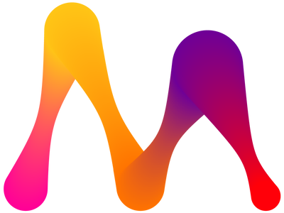

# Awesome Memgraph 

> Useful resources  for learning and working with [Memgraph](https://memgraph.com)

Memgraph is an open source graph database built for real time streaming data,
compatible with Neo4j. It is an in-memory graph database that uses Cypher as a
query language.

## Contents

- [Resources](#resources)
   - [Documentation](#documentation)
   - [Docker images](#docker-images)
   - [Tools](#tools)
- [Articles](#articles)
- [Talks](#talks)
- [Tutorials](#tutorials)
- [Drivers](#drivers)
- [Applications](#applications)

## Resources

### Documentation

- [Memgraph documentation](https://memgraph.com/docs)
- [Getting started with Memgraph](https://memgraph.com/docs/memgraph)
- [Getting started with Cypher](https://memgraph.com/docs/cypher-manual)

### Docker images

- [Memgraph Docker images](https://hub.docker.com/u/memgraph)

### Tools

- [Memgraph Lab](https://memgraph.com/lab) - a visual user interface that helps you explore and manipulate the data stored in Memgraph.
- [GQLAlchemy](https://memgraph.com/gqlalchemy) - a standalone Object Grap Mapper (OGM) for Python that allows you to write object-oriented code to communicate with graph databases.
- [MAGE](https://memgraph.com/mage) - an open-source library that contains graph algorithms in the form of query modules you can use right away with our graph database.

## Articles

- [Graph Database vs Relational Database](https://memgraph.com/blog/graph-database-vs-relational-database)
- [How to migrate from Neo4j to Memgraph](https://memgraph.com/blog/how-to-migrate-from-neo4j-to-memgraph)
- [Temporal graph neural networks with PyTorch](https://memgraph.com/blog/amazon-user-item-recommender-with-tgn-and-memgraph)  - How to create a simple recommendation engine on an Amazon dataset.
- [How to use GQLAlchemy query builder?](https://memgraph.com/blog/gqlalchemy-query-builder)
- [How to manage Memgraph Docker instances in Python](https://memgraph.com/blog/running-memgraph-with-python)
- [Importing Table Data into a Graph Database with GQLAlchemy](https://memgraph.com/blog/jupyter-translate-data-to-graph-database)
- [Exploring a Twitter Network with Memgraph in a Jupyter Notebook](https://memgraph.com/blog/jupyter-notebook-twitter-network-analysis)

## Talks

- [Memgraph 2.1](https://www.youtube.com/watch?v=ayyRy5Ln-uY) - Live Demo with Dominik, CEO & Marko, CTO.
- [Graph-based stream processing with Apache Kafka](https://www.youtube.com/watch?v=qOtOfaCF53k)
- [MAGE 1.1 Live Demo](https://www.youtube.com/watch?v=dn154j4sypo) - Analyzing a Twitter network with PageRank, node2vec & Community detection.
- [GQLAlchemy 1.1](https://www.youtube.com/watch?v=r5YVD_1D8G8) - Demo.

## Tutorials

- [First steps with Memgraph](https://memgraph.com/docs/memgraph/tutorials/first-steps-with-memgraph)
- [Graph modeling](https://memgraph.com/docs/memgraph/tutorials/graph-modeling)
- [Implement a custom query module in Python](https://memgraph.com/docs/memgraph/tutorials/implement-custom-query-module-in-python)
- [Install MemgraphDB and Memgraph Lab on Windows 10](https://memgraph.com/docs/memgraph/tutorials/install-memgraph-windows-10)
- [Style your graphs in Memgraph Lab](https://memgraph.com/docs/memgraph/tutorials/style-your-graphs-in-memgraph-lab)
- [Migrate from RDBMS to Memgraph](https://memgraph.com/docs/memgraph/tutorials/migrate-relational-database)
- [Graph stream processing with Kafka](https://memgraph.com/docs/memgraph/tutorials/graph-stream-processing-with-kafka)
- [Social network analysis with NetworkX](https://memgraph.com/docs/memgraph/tutorials/social-network-analysis)
- [Understanding music (with query modules](https://memgraph.com/docs/memgraph/tutorials/understanding-music-with-modules)
- [Analyzing Interactions in a Slack Communication Network](https://memgraph.com/blog/slack-influence-bot)
- [How to build a Spotify Recommendation Engine using Kafka and Memgraph](https://memgraph.com/blog/spotify-song-recommender)
- [Visualizing and Analyzing Reddit In Real-Time with Kafka and Memgraph](https://memgraph.com/blog/reddit-network-explorer)
- [Building a BitClout Social Network Visualization App With Memgraph and D3.js](https://memgraph.com/blog/visualize-the-bitclout-network-using-d3js)
- [How to Build a Flight Network Analysis Graph-Based ASP.NET Application with Memgraph, C#, and D3.js](https://memgraph.com/blog/how-to-build-a-flight-network-analysis-graph-asp-net-application-with-memgraph-c-sharp-and-d3-js)
- [How to Develop a Credit Card Fraud Detection Application using Memgraph, Flask, and D3.js](https://memgraph.com/blog/how-to-develop-a-credit-card-fraud-detection-application-using-memgraph-flask-and-d3js)
- [Exploring Interpersonal Relationships in the Bible](https://memgraph.com/blog/exploring-the-hebrew-bible-person-relationships)
- [How to Implement Custom JSON Utility Procedures With Memgraph MAGE and Python](https://memgraph.com/blog/how-to-implement-custom-json-utility-procedures-with-memgraph-mage-and-python)
- [How to Write Custom Cypher Procedures with NetworkX and Memgraph](https://memgraph.com/blog/how-to-write-custom-cypher-procedures-with-networkx-and-memgraph)
- [Influencers among computer scientists](https://memgraph.com/blog/influencers-among-computer-scientists)
- [Modeling, Visualizing, and Navigating a Transportation Network with Memgraph](https://memgraph.com/blog/modeling_visualizing_navigating_a_transportation_network_with_memgraph)
- [Optimizing Telco Networks With Graph Coloring & Memgraph MAGE](https://memgraph.com/blog/optimizing_telco_networks_with_graph_coloring_and_memgraph_mage)
- [Running Community Detection with Memgraph and Python NetworkX](https://memgraph.com/blog/community-detection-with-memgraph-and-python-networkx)

## Drivers

- [Python](https://memgraph.com/docs/memgraph/connect-to-memgraph/drivers/python) - driver for  conecting to Memgraph using Python.
- [Rust](https://memgraph.com/docs/memgraph/connect-to-memgraph/drivers/rust) - driver for  conecting to Memgraph using Rust.
- [C#](https://memgraph.com/docs/memgraph/connect-to-memgraph/drivers/c-sharp) - driver for  conecting to Memgraph using C#.
- [Java](https://memgraph.com/docs/memgraph/connect-to-memgraph/drivers/java) - driver for  conecting to Memgraph using Java.
- [Go](https://memgraph.com/docs/memgraph/connect-to-memgraph/drivers/go) - driver for  conecting to Memgraph using Go.
- [Node.js](https://memgraph.com/docs/memgraph/connect-to-memgraph/drivers/nodejs) - driver for  conecting to Memgraph using Node.js.
- [JavaScript](https://memgraph.com/docs/memgraph/connect-to-memgraph/drivers/javascript) - driver for  conecting to Memgraph using JavaScript.
- [PHP](https://memgraph.com/docs/memgraph/connect-to-memgraph/drivers/php) - driver for  conecting to Memgraph using PHP.

## Applications 

- [Analyze Infrastructure Networks with Dynamic Betweenness Centrality](https://memgraph.com/blog/analyze-infrastructure-networks-with-dynamic-betweenness-centrality)
- [Monitoring a Dynamic Contact Network with Online Community Detection](https://memgraph.com/blog/monitoring-dynamic-contact-network-with-online-community-detection)
- [LabelRankT](https://memgraph.com/blog/labelrankt-community-detection-in-dynamic-environment) -  Community Detection in Dynamic Environment.
- [Link prediction with Node2Vec in Physics Collaboration Network](https://memgraph.com/blog/link-prediction-with-node2vec-in-physics-collaboration-network)
- [How Node2Vec works](https://memgraph.com/blog/how-node2vec-works) - A random walk-based node embedding method.
- [Introduction to Node Embedding](https://memgraph.com/blog/introduction-to-node-embedding)
- [Recommendation System Using Online Node2Vec with Memgraph MAGE](https://memgraph.com/blog/online-node2vec-recommendation-system)
- [Twitch Streaming Graph Analysis](https://memgraph.com/blog/twitch-streaming-graph-analysis)
- [Identifying Essential Proteins using Betweenness Centrality & Memgraph MAGE](https://memgraph.com/blog/identifying-essential-proteins)
- [Optimizing Telco Networks With Graph Coloring & Memgraph MAGE](https://memgraph.com/blog/optimizing-telco-networks-with-graph-coloring-and-memgraph-mage)
- [Vislet](https://memgraph.com/blog/vislet-visualize-geographic-data-in-memgraph-lab) - Visualize geographic data in Memgraph Lab.
- [How to style your graphs in Memgraph Lab](https://memgraph.com/blog/how-to-style-your-graphs-in-memgraph-lab)
- [Air Traffic Routing with Memgraph](https://memgraph.com/blog/air-traffic-routing-with-memgraph)
- [Building a Recommendation System using Memgraph](https://memgraph.com/blog/building-a-recommendation-system-using-memgraph)
- [How to Visualize a Social Network in Python with a Graph Database: Flask + Docker + D3.js](https://memgraph.com/blog/how-to-visualize-a-social-network-in-python-with-a-graph-database)

## Contributing 

Contributions welcome! Read the [contribution guidelines](contributing.md) first.
